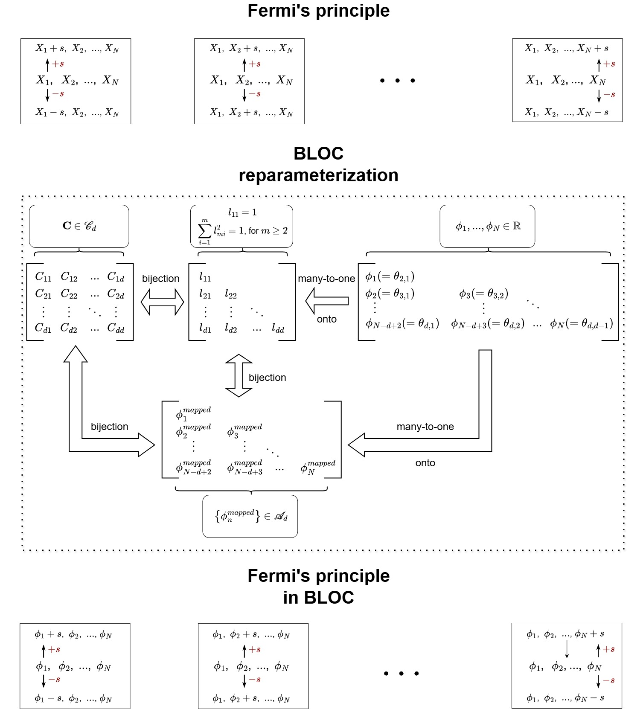
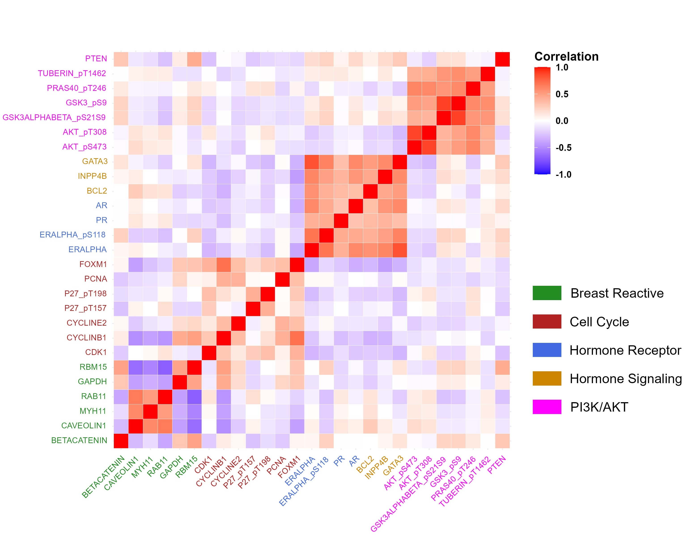
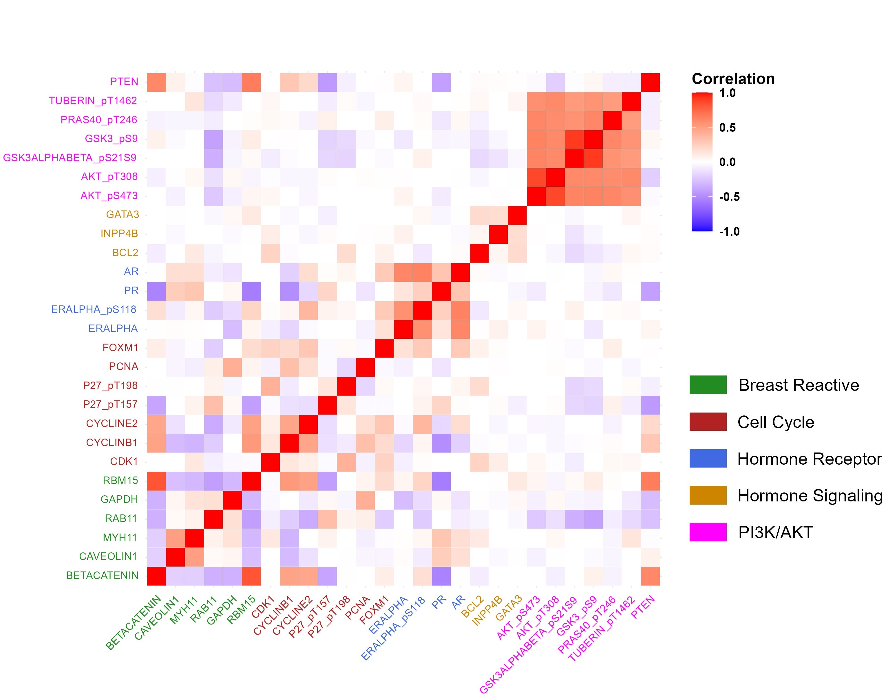
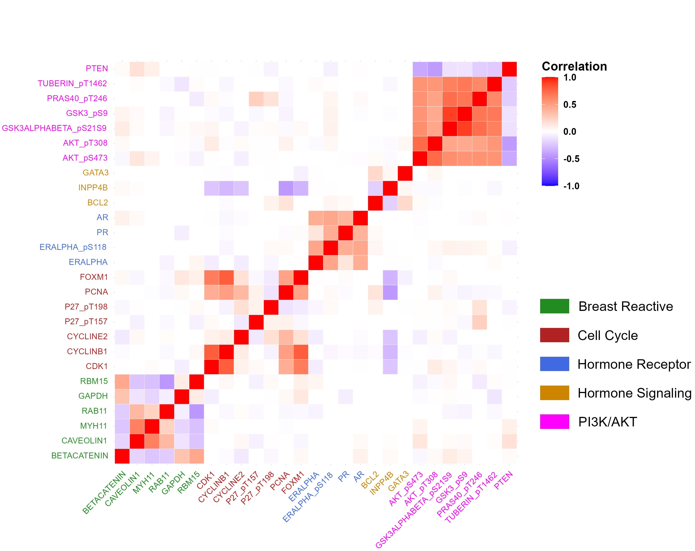
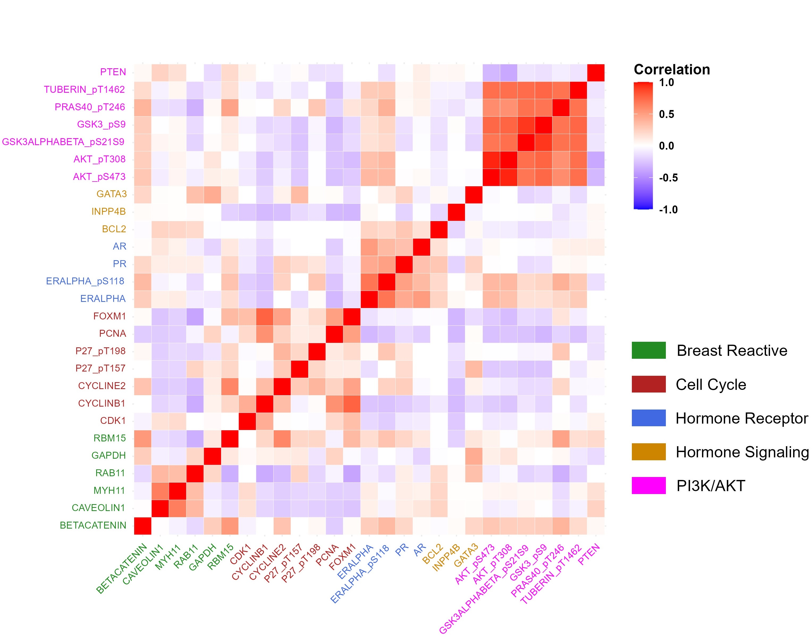
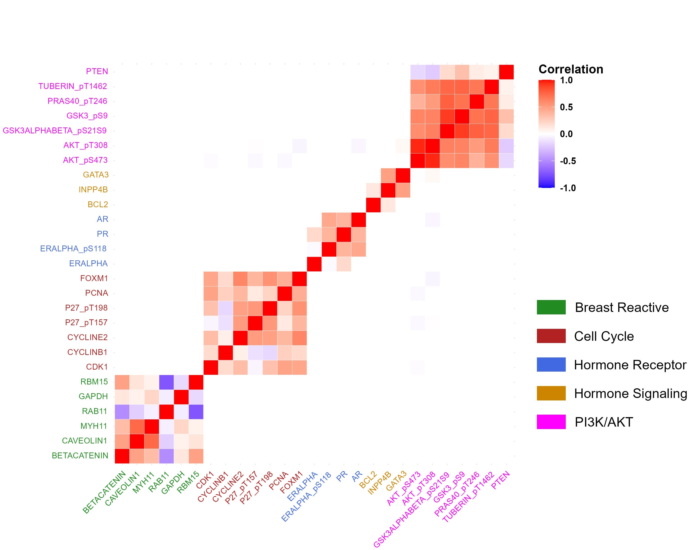

# BLOC: Black-box Optimization over Correlation Matrices

**BLOC** (*Black-box Optimization over Correlation matrices*) is a general-purpose framework for **sparse correlation and covariance matrix estimation** under **arbitrary (possibly non-convex, non-differentiable, or black-box) objective functions**.

BLOC is designed to operate **directly on the space of valid correlation matrices**, guaranteeing **positive definiteness and unit diagonals at every iteration**, while enabling **global, gradient-free optimization**. The method couples a **geometric reparameterization of the correlation matrix manifold** with a powerful **recursive pattern search algorithm**, making it both flexible and scalable in high dimensions.

---

### Notation note

Throughout the code, comments, and documentation, the symbols **`p`** and **`d`** may occasionally be used interchangeably.  
Both symbols refer to the **same quantity**: the **dimension of the correlation matrix of interest**.

This interchangeable usage reflects differences in notation commonly adopted across optimization and statistical literature.  
For clarity, readers may treat **`p ≡ d`** everywhere in this repository.

---

## 📂 Repository Structure

The current top-level layout of this repository (branch: `main`) is:

```text
BLOC/
├── Benchmark/                 # Benchmark experiments and comparisons
├── DEMO/                      # Demo scripts illustrating how to use BLOC (serial + parallel examples)
├── Real data analysis/        # Real-data application workflows (proteomics network analysis)
├── Simulation study/          # Simulation experiments for baseline / moderate dimension settings, using Gaussian likelihood
├── Simulation study large p/  # Simulation experiments for large-d (or p) / high-dimensional regimes, using Frobenius norm
├── images/                    # Figures used in the paper/README (e.g., diagrams, flowcharts)
└── README.md                  # Main repository README
```
---

## 🔑 Key Features

- **Guaranteed validity**  
  Every iterate produced by BLOC is a valid correlation matrix: symmetric, positive definite, and with unit diagonal entries.

- **Black-box optimization**  
  The objective function only needs to be *evaluated*. No gradients, Hessians, likelihood structure, or smoothness assumptions are required.

- **Penalty-agnostic**  
  Supports both convex and non-convex penalties, including LASSO, Ridge, Elastic Net, SCAD, MCP, capped-ℓ₁, as well as fully user-defined penalties.

- **Global exploration**  
  Built-in restart and step-size reset mechanisms allow the algorithm to systematically escape poor local minima and explore the objective landscape.

- **Parallelizable**  
  Coordinate-wise objective evaluations can be executed in parallel.  
  For a d-by-d correlation matrix, up to d(d−1)/2 coordinate directions can be evaluated simultaneously.

- **Scalable to high dimensions**  
  Designed to perform reliably in both low-dimensional (d < n) and high-dimensional (d > n) regimes.

---


## 📌 Problem Setting

Let Γ₀ denote a sparse *d × d* correlation matrix.  
BLOC targets optimization problems of the form:

<pre>
minimize   hₙ(Γ) + ∑<sub>i ≠ j</sub> p<sub>λ</sub>(|γ<sub>ij</sub>|)
subject to Γ ∈ 𝒞<sub>d</sub>
</pre>

where:

- **𝒞<sub>d</sub>** denotes the space of full-rank correlation matrices (symmetric, positive definite, unit diagonal).
- **h<sub>n</sub>(·)** is an arbitrary empirical loss (e.g., Gaussian negative log-likelihood, Frobenius-norm loss, robust loss, depth-based loss).
- **p<sub>λ</sub>(·)** is a sparsity-inducing penalty applied to off-diagonal entries (e.g., LASSO, SCAD, MCP, capped-ℓ₁, or user-defined penalties).

Direct optimization over **𝒞<sub>d</sub>** is challenging due to the positive-definiteness and unit-diagonal constraints.  
BLOC resolves this by reparameterizing the correlation-matrix manifold via an angular Cholesky transformation, converting the problem into an unconstrained Euclidean optimization while ensuring every iterate remains a valid correlation matrix.

---

## 🧠 Method Overview

### 1. Angular Cholesky Reparameterization

Every correlation matrix Γ belonging to the space 𝒞<sub>d</sub> admits a unique Cholesky decomposition of the form

Γ = L · Lᵀ,

where L is a lower-triangular matrix with unit-norm rows and positive diagonal entries.  
Each row of L therefore lies on a unit hypersphere.

BLOC represents these rows using **hyperspherical (angular) coordinates**, which induces a **smooth, bijective mapping** between the space of valid correlation matrices and an open hyperrectangle in Euclidean space of dimension d(d−1)/2. This transformation allows unconstrained optimization while guaranteeing that every iterate corresponds to a valid correlation matrix.


<p align="center">
  
</p>

This mapping ensures:
- unconstrained optimization in Euclidean space,
- automatic enforcement of correlation-matrix constraints.

---

### 2. Recursive Modified Pattern Search (RMPS)

On the transformed space, BLOC applies **Recursive Modified Pattern Search (RMPS)**, a derivative-free global optimization algorithm featuring:

- coordinate-wise polling in d(d−1) directions while optimizing over 𝒞<sub>d</sub>,
- adaptive step-size reduction,
- run-wise restarts for global exploration,
- parallel evaluation of candidate points.

<p align="center">
  
</p>

---

## 📐 Theoretical Guarantees

BLOC is supported by rigorous theory, including:

- **Statistical guarantees**  
  - Frobenius-norm convergence rates for local minimizers  
  - Sparsistency (exact support recovery) under standard non-convex penalties  

- **Algorithmic guarantees**  
  - Stationarity when no improving coordinate direction exists  
  - Probabilistic reachability of neighborhoods of the global minimizer  
  - Global convergence in probability under mild regularity conditions  
  - Sublinear convergence rates for smooth convex objectives (within a run)

These results hold for **general losses**, extending classical theory beyond Gaussian likelihoods.

---

## 🧪 Numerical results for sparse covariance estimation

We evaluate the finite-sample performance of **BLOC** through extensive simulation studies under standard sparse covariance models. Results are reported for both low-dimensional (n > d) and high-dimensional (d ≥ n) regimes, with performance assessed in terms of estimation accuracy, sparsity recovery, and numerical stability. Across all experiments, BLOC is compared against representative state-of-the-art methods for sparse covariance estimation.

---

## 🔹 Gaussian likelihood setting (n > d)

We first consider the classical regime in which the number of observations exceeds the number of variables (n > d), where the Gaussian log-likelihood provides a natural loss function. In this setting, BLOC is instantiated using a likelihood-based objective and equipped with **nonconvex penalties** (SCAD and MCP). Performance is compared against the ℓ1-penalized estimator implemented in the `Spcov` R package, representing a convex baseline.

Two sparsity designs are examined:

- **Block-diagonal structure**, where variables form small correlated clusters and all other entries are zero.
- **Uniform-sparse structure**, where a small fraction of off-diagonal correlations are nonzero and scattered irregularly.

Across all configurations, BLOC with SCAD or MCP achieves a favorable balance between estimation accuracy and sparsity recovery. Under block-diagonal designs, BLOC attains consistently high true positive rates while controlling false positives, leading to substantially improved Matthews correlation coefficients compared with ℓ1 penalization, which tends to over-select edges. Under uniform sparsity, the advantages of nonconvex penalties are even more pronounced: BLOC maintains low false positive rates while accurately recovering dispersed signals.

As dimensionality increases, BLOC remains stable and reliable, whereas the ℓ1-based estimator either deteriorates in accuracy or fails numerically in the largest settings. These results highlight the robustness of BLOC under Gaussian likelihood, combining reduced bias from nonconvex penalties with the reliability of global optimization.

---

## 🔹 Frobenius-norm setting (d ≥ n)

We next study the high-dimensional regime where the number of variables is comparable to or exceeds the sample size (d ≥ n). In this setting, likelihood-based methods become unstable, and BLOC instead minimizes a Frobenius-norm loss measuring discrepancy between the estimated and sample correlation matrices.

Three canonical covariance structures are considered:

- **Block-diagonal**, representing clustered dependence,
- **Toeplitz**, capturing long-range dependence with geometric decay,
- **Banded**, representing local dependence with finite bandwidth.

BLOC with SCAD and MCP penalties is compared against a broad collection of existing methods, including ℓ1-ADMM estimators, reweighted ADMM procedures, nonconvex block coordinate descent algorithms, and standard thresholding approaches. Implementations of competing methods follow established benchmark settings.

Across all structures and dimensional regimes, BLOC consistently delivers the lowest Frobenius and spectral norm errors, as well as the smallest mean absolute deviation of off-diagonal entries. Importantly, BLOC maintains a strong balance between sensitivity and specificity: true positive rates remain high without the inflation of false positives commonly observed for thresholding and ℓ1-based methods, resulting in superior Matthews correlation coefficients.

As dimensionality increases, the advantage of BLOC becomes more pronounced. While many competing methods suffer from numerical instability or degraded accuracy, BLOC remains stable and continues to recover sparse correlation structure effectively. These findings demonstrate that BLOC provides a robust and scalable solution for sparse covariance estimation in challenging high-dimensional settings.

---

## 🧬 Pathway-informed correlation estimation for pan-gynecologic proteomics data


We illustrate the practical utility of **BLOC** through an application to **reverse-phase protein array (RPPA)** data from *The Cancer Genome Atlas (TCGA)*, focusing on five pan-gynecologic cancers:

- Breast carcinoma (**BRCA**)
- Cervical squamous cell carcinoma (**CESC**)
- Ovarian serous cystadenocarcinoma (**OV**)
- Uterine corpus endometrial carcinoma (**UCEC**)
- Uterine carcinosarcoma (**UCS**)

These cancers share common hormonal drivers and signaling dysregulation, yet differ markedly in clinical presentation and disease progression. Understanding **protein–protein correlation structure across key signaling pathways** is therefore of strong biological and translational interest.

The proteomics data are obtained from *The Cancer Proteome Atlas (TCPA)* and consist of RPPA-based protein abundance measurements spanning diverse cellular processes, including cell cycle regulation, hormone receptor activity, PI3K/AKT signaling, apoptosis, metabolism, immune response, and epithelial–mesenchymal transition.

---

### Pathway-informed objective function

To reflect known biological structure in estimation, we leverage the general flexibility of **BLOC**, which can optimize any user-defined objective function over the space of correlation matrices. This allows us to incorporate structured penalties through a *penalty cover*, specifying exactly which entries of the correlation matrix are subject to penalization.

In this application, proteins are grouped into biologically meaningful signaling pathways. Proteins within the same pathway are expected to interact and therefore exhibit correlated behavior; accordingly, **within-pathway correlations are not penalized**. In contrast, correlations between proteins from different pathways are less likely to be consistently strong and are therefore **penalized unless strongly supported by the data**.

The 27 proteins are partitioned into five non-overlapping pathways. Let g(i) denote the pathway membership of protein i. We define a binary penalty-cover matrix P as:

<pre>
    P<sub>ij</sub>  = 0   if proteins i and j belong to the same pathway
    P<sub>ij</sub>  = 1   if proteins i and j belong to different pathways
</pre>
  
The matrix P is symmetric, so P_ij = P_ji. With this construction, only **across-pathway protein pairs** are penalized.

For each cancer type, the correlation matrix is estimated by solving the following structured penalized optimization problem:

<pre>
minimize   h<sub>n</sub>(Γ)
           + λ · ∑<sub>i &lt; j</sub> P<sub>ij</sub> · SCAD(|Γ<sub>ij</sub>|; a)

subject to Γ ∈ 𝒞<sub>d</sub>
           (symmetric, positive definite, unit diagonal)
</pre>

Here, h<sub>n</sub>(Γ) denotes the chosen data-fit loss, λ controls the overall degree of sparsity, and SCAD(·; a) is a nonconvex penalty with shape parameter a. The binary matrix P defines the penalty cover: correlations between proteins within the same biological pathway are left unpenalized, while correlations across different pathways are selectively shrunk toward zero.

Equivalently, the penalty acts on the elementwise (Hadamard) product P ∘ Γ, producing a **block-structured penalty** that preserves within-pathway coherence while encouraging sparsity across pathways. This biologically informed design yields interpretable correlation networks that align closely with known signaling biology.

---

### Estimated sparse correlation structures by cancer type

Each heatmap below shows the estimated sparse protein–protein correlation matrix obtained using **BLOC with a SCAD penalty and a pathway-based penalty cover**. Proteins are ordered by pathway membership, so block structure corresponds to biological modules.

---

#### **BRCA — Breast Carcinoma**
<p align="center">
  
</p>

Strong within-pathway coherence is observed in Cell Cycle and PI3K/AKT modules, together with pronounced cross-talk between Hormone Receptor and Hormone Signaling pathways.

---

#### **CESC — Cervical Squamous Cell Carcinoma**
<p align="center">
  
</p>

CESC exhibits comparatively weaker and more diffuse cross-pathway correlations, consistent with a less hormone-driven biological profile.

---

#### **OV — Ovarian Serous Cystadenocarcinoma**
<p align="center">
  
</p>

OV shows partial integration between the PI3K/AKT and Cell Cycle pathways, suggesting coordinated proliferative signaling mechanisms.

---

#### **UCEC — Uterine Corpus Endometrial Carcinoma**
<p align="center">
  
</p>

UCEC demonstrates strong Hormone Receptor–Hormone Signaling interactions, closely resembling the network structure observed in BRCA.

---

#### **UCS — Uterine Carcinosarcoma**
<p align="center">
  
</p>

UCS displays a strikingly modular structure with near-independent Cell Cycle and PI3K/AKT blocks. The extreme sparsity reflects both biological heterogeneity and limited sample size.

---

**Summary:**  
BLOC preserves biologically expected within-pathway correlations while adaptively shrinking cross-pathway edges, revealing tumor-specific differences in pathway integration across pan-gynecologic cancers.

---

## 💬 Discussion

**BLOC** is a general-purpose framework for sparse covariance and correlation matrix estimation with the following key characteristics:

- **Methodological generality**
  - Optimizes arbitrary objective functions over the space of valid correlation matrices.
  - Imposes no restrictions on the choice of loss function or sparsity penalty.
  - Naturally accommodates nonconvex penalties such as SCAD and MCP.
  - Supports customized masking or penalty-cover structures to encode domain knowledge.

- **Strong empirical performance**
  - Consistently achieves low estimation error and accurate support recovery.
  - Performs well in both low-dimensional (n > d, Gaussian likelihood) and high-dimensional (d ≥ n, Frobenius loss) regimes.
  - Nonconvex penalties improve Frobenius and spectral norm accuracy relative to ℓ1-based baselines.
  - Delivers superior sparsity recovery measured by mean absolute deviation and Matthews correlation coefficient.
  - Recursive modified pattern search effectively escapes poor local minima, balancing global exploration with local refinement.

- **Theoretical support**
  - Limit points of the algorithm satisfy local stationarity conditions.
  - Restart mechanisms provide global reachability of high-quality solutions.
  - Convergence guarantees are available under convex objectives, supporting practical reliability.

- **Computational scalability**
  - Naturally parallelizable due to coordinate-wise perturbations in the angular parameterization.
  - Evaluations can be distributed across independent threads with minimal communication.
  - Parallel implementations exhibit substantial runtime reductions and near-linear speedups in higher dimensions.
  - Remains practical for large-scale and rugged optimization problems.

- **Real-data applicability**
  - Easily integrates biological prior knowledge through pathway-based penalty covers.
  - Preserves expected within-pathway coherence while revealing tumor-specific cross-pathway differences.
  - Produces interpretable correlation networks without modifying the core algorithm.

- **Limitations and future directions**
  - Not always the fastest option for simple, convex problems where specialized solvers may suffice.
  - Global exploration increases computational cost relative to purely local methods.
  - Future work includes accelerated variants, adaptive exploration strategies, and hybrid global–local optimization schemes.

Overall, BLOC provides a flexible, globally aware, and parallelizable approach that advances the state of the art in correlation matrix optimization while maintaining both theoretical rigor and practical usability.


